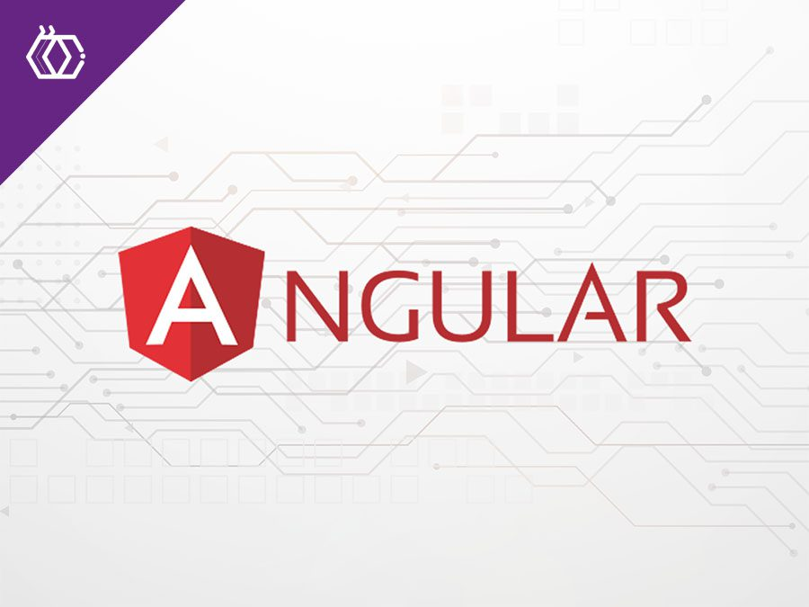

# Cómo instalar y configurar Angular 19 | Node 20+ | Angular CLI

[Link a la versión web](https://josetello.com/angular-installation/)



Guía rápida y práctica para iniciar un proyecto moderno en Angular 19. Ideal para demostrar en tu GitHub que conoces el flujo básico.

## Paso 1 — Instalar Node.js (20+)

Angular 19 requiere Node.js 20 o superior. Descarga e instala desde [nodejs.org](https://nodejs.org/)

```
node -v
npm -v
```

## Paso 2 — Instalar Angular CLI

Instala la herramienta oficial:

```
npm install -g @angular/cli
```

Verifica:

```
ng version
```

## Paso 3 — Crear un nuevo proyecto

Crear el proyecto (ejemplo <code>mi-angular-app</code>):

```
ng new mi-angular-app
```

Cuando pregunte, responde: <strong>Yes</strong> para routing y elige <strong>SCSS</strong> o <strong>CSS</strong>.

## Paso 4 — Ejecutar la aplicación

```
cd mi-angular-app
ng serve -o
```

El navegador abrirá: <code>http://localhost:4200/</code>

## Paso 5 — Crear un componente

Ejemplo: crear componente <code>pages/inicio</code>:

```
ng g c pages/inicio
```

## Paso 6 — Routing básico

Editar <code>src/app/app-routing.module.ts</code> y añadir:

```
import { NgModule } from '@angular/core';
import { RouterModule, Routes } from '@angular/router';
import { InicioComponent } from './pages/inicio/inicio.component';

const routes: Routes = [
  { path: '', component: InicioComponent }
];

@NgModule({
  imports: [RouterModule.forRoot(routes)],
  exports: [RouterModule]
})
export class AppRoutingModule { }
```

## Paso 7 — Código mínimo del componente

En <code>inicio.component.html</code> puedes poner:

```
<h1>Bienvenido a Angular 19</h1>
<p>Este es un componente de ejemplo.</p>
```

## Paso 8 — Construir para producción

```
ng build
```

Los archivos finales quedan en <code>dist/mi-angular-app/</code>.

<h4>Consejos rápidos</h4>
<ul>
  <li>Usa <code>ng generate service</code> para servicios (API).</li>
  <li>Para estilos rápidos añade <code>tailwindcss</code> o usa Bootstrap.</li>
  <li>Si usas GitHub Pages, sube la carpeta <code>dist</code> o usa <code>angular-cli-ghpages</code>.</li>
</ul>

Guía creada para demostrar conocimiento práctico de Angular en proyectos personales.